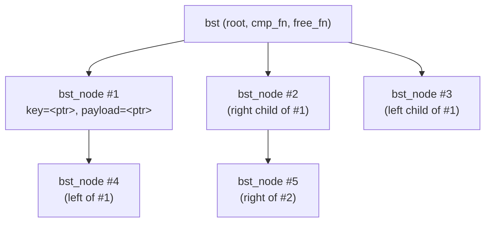
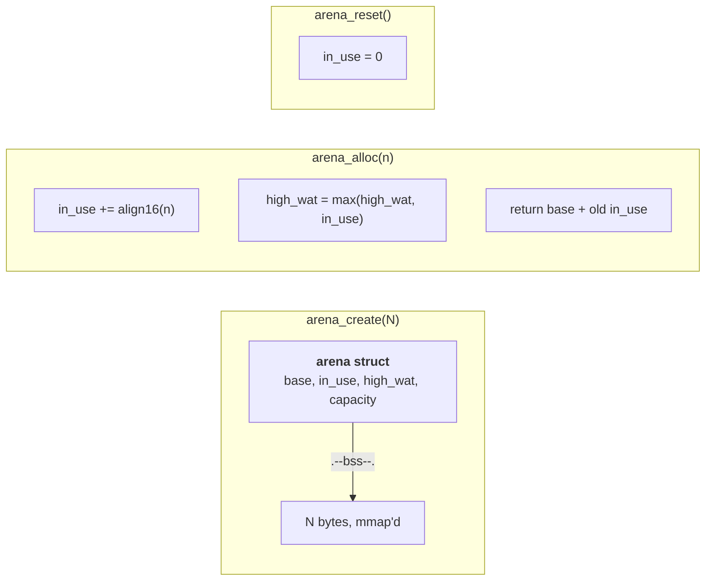
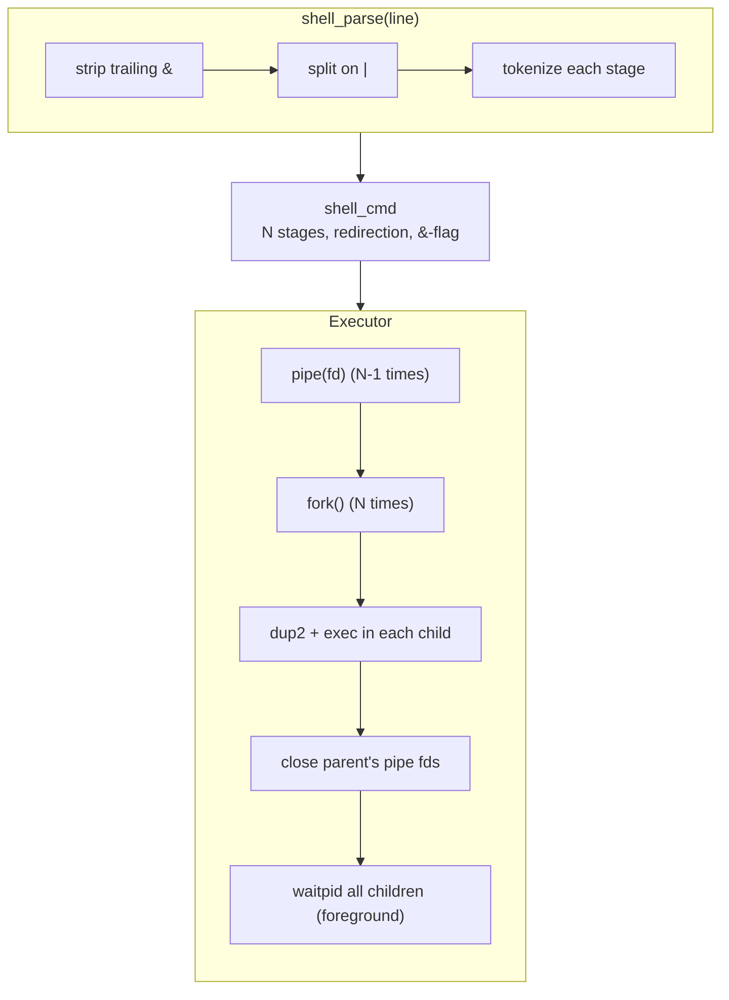

# Project showcase

Deep-dive on each of the standalone projects.

## 1. `bst-library` — generic binary-search tree

> *Week 4 capstone.  The first C project polished enough to
> be shown off.*

### What it does

- Generic: stores `void*` payloads, accepts a user-supplied
  comparator.
- Operations: insert, find, remove, min, max, in-order walk.
- Memory: caller-supplied allocator hook — zero `malloc`
  inside the library itself.

### Architecture



The tree is unbalanced (no AVL / red-black).  A separate
week, if there is one, will produce a balanced variant.

### API surface

```c
bst  *bst_create(bst_cmp_fn cmp, bst_free_fn free_key);
void  bst_destroy(bst *t, bst_free_fn free_key, bst_free_fn free_payload);
int   bst_insert (bst *t, const void *key, void *payload);
void *bst_find   (const bst *t, const void *key);
int   bst_remove (bst *t, const void *key);
void  bst_inorder(const bst *t, bst_visit_fn visit, void *ctx);
```

### Tests & benchmarks

- 74 assertions, 8 test cases, all passing.
- Microbenchmark (`bench/bench_bst.c`): ~3.5 M insert/s,
  ~4.8 M find/s on Apple M-series.

### Repo

https://github.com/404Piyush/bst-library

---

## 2. `arena-allocator` — bump arena

> *Week 8 project.  The simplest correct memory allocator
> there is.*

### What it does

- One contiguous mmap'd region; a single bump pointer.
- `arena_alloc(a, n)` — O(1), returns a 16-byte-aligned slice.
- `arena_reset(a)` — O(1), rewinds the bump pointer to 0.
- `arena_destroy(a)` — munmaps the region.
- High-watermark tracking for memory budgeting.

### Architecture



### API surface

```c
arena *arena_create(size_t capacity);
void  *arena_alloc  (arena *a, size_t size);
void   arena_reset  (arena *a);
void   arena_destroy(arena *a);
size_t arena_in_use (const arena *a);
size_t arena_high_wat(const arena *a);
```

### Why bump?

- **O(1) every operation** — no per-allocation bookkeeping.
- **No fragmentation** — used memory is always contiguous.
- **Perfect for phases** — request handlers, parsers,
  compilers, frame allocators.  All alloc freely, reset at
  the end of the request.
- **Cheap to reset** — the cost of a single pointer write.

### Tests & benchmarks

- 143 assertions, 9 test cases, all passing.
- Microbenchmark (`bench/bench_arena.c`): ~14× faster than
  `malloc`/`free` for 1 M small allocations (455 M ops/s vs
  33 M ops/s on M-series).

### Repo

https://github.com/404Piyush/arena-allocator

---

## 3. `pipe-shell` — POSIX-ish command interpreter

> *Week 11 capstone.  The reason this curriculum exists.*

### What it does

- Recursive-descent parser: line → AST.
- Pipelines: `cmd1 | cmd2 | cmd3`.
- Redirection: `<`, `>`, `>>`.
- Background: trailing `&`.
- Built-ins: `exit [N]`, `cd [DIR]`.
- Interactive REPL and one-shot `--run`.

### Architecture



The crucial detail: **every** pipe fd the parent has a copy
of must be closed, or the consumer's `read(2)` will block
forever.

### Why this matters

A POSIX shell is the universal Swiss-army knife of Unix.
A 500-line shell that handles pipelines correctly is the
*smallest* version of `bash` worth understanding.  Once you
can read it, the rest of Unix — daemons, init, job control,
container runtimes — falls into place.

### Tests

- 56 assertions, 13 test cases, all passing.
- Covers parser (8 cases) and executor (5 cases).

### Repo

https://github.com/404Piyush/pipe-shell
