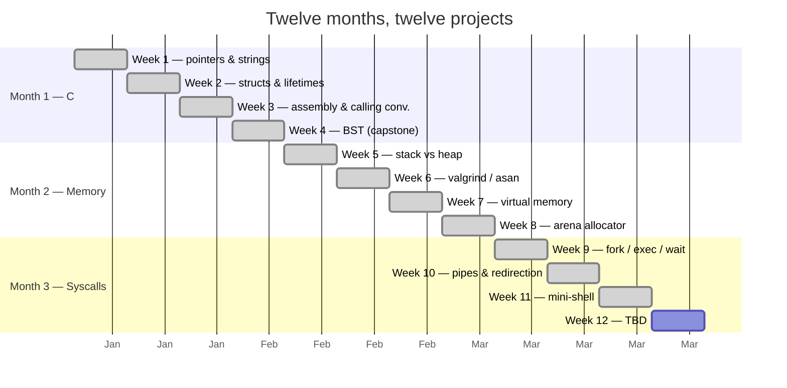
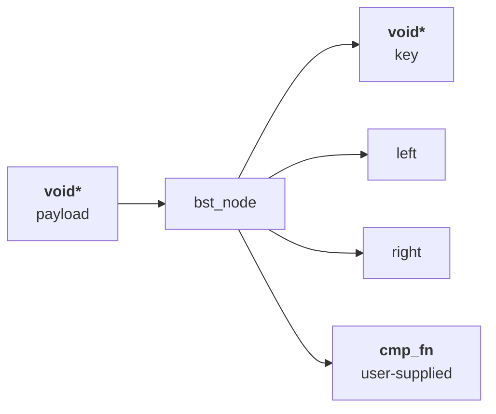
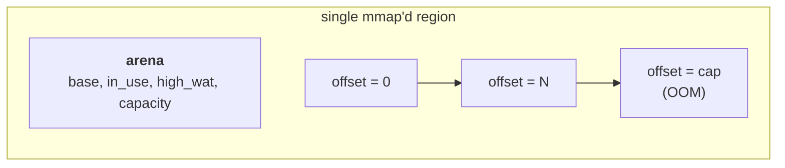

# gpu-engineering

A twelve-month, twelve-project curriculum aimed at becoming a
GPU-systems engineer.  The repo tracks the journey — every
week, every program, every reference, every mistake.

<div align="center">

[](https://github.com/404Piyush/gpu-engineering)
[](https://github.com/404Piyush/gpu-engineering)
[](https://github.com/404Piyush?tab=repositories&q=&type=&language=c&sort=)
[](LICENSE)

</div>

---

## 🎯 The goal

By month 12 I want to be able to:

- Write a small, correct, idiomatic C program from a spec.
- Read x86-64 disassembly and tell you what the compiler did.
- Trace a page fault from the user-space instruction to the
  kernel handler.
- Build a custom memory allocator and a custom shell.
- Reason about a GPU kernel: occupancy, divergence, coalescing.

---

## 🗓️ Curriculum map

| Month | Theme                          | Weeks        |
|------:|--------------------------------|--------------|
| 1     | The C machine                  | 1–4          |
| 2     | Memory is real                 | 5–8          |
| 3     | Syscalls & the process model   | 9–11         |
| 4+    | GPU engineering                | 12+ (planned) |

The full per-week breakdown is below.



---

## 🚀 Standalone projects

Three of the weeks produced a project polished enough to
live in its own public repo.  These are the portfolio
highlights.

| # | Project         | What it is                                            | Repo                                                                   | Mirror                                  |
|--:|-----------------|-------------------------------------------------------|------------------------------------------------------------------------|------------------------------------------|
| 1 | `bst-library`   | Generic binary-search tree in C11 (Week 4 capstone)   | [404Piyush/bst-library](https://github.com/404Piyush/bst-library)       | [`projects/bst-library/`](projects/bst-library)         |
| 2 | `arena-allocator` | Bump arena memory allocator in C11 (Week 8 project) | [404Piyush/arena-allocator](https://github.com/404Piyush/arena-allocator) | [`projects/arena-allocator/`](projects/arena-allocator) |
| 3 | `pipe-shell`    | POSIX-ish command interpreter in C11 (Week 11 cap.)   | [404Piyush/pipe-shell](https://github.com/404Piyush/pipe-shell)         | [`projects/pipe-shell/`](projects/pipe-shell)           |

Each project ships with:

- ✅ Source under MIT
- ✅ Test suite with 100% pass rate
- ✅ Microbenchmark
- ✅ Architecture & API docs
- ✅ CI on Linux + macOS × {gcc, clang}

---

## 📦 `bst-library`

A generic binary-search tree in ~500 lines of C11.



- **Generic** — stores `void*` payloads and accepts a
  user-supplied comparator.
- **Tested** — 74 assertions across 8 test cases.
- **Benchmarked** — 3.5 M insert/s, 4.8 M find/s on M-series.

```c
#include "bst.h"

int cmp_int(const void *a, const void *b) { return *(int*)a - *(int*)b; }

int main(void) {
    bst *t = bst_create(cmp_int, NULL);
    int keys[] = {5, 3, 7, 1, 4, 6, 8};
    for (int i = 0; i < 7; i++) bst_insert(t, &keys[i], &keys[i]);
    bst_print(t, stdout, print_int_key);
    bst_destroy(t, NULL, NULL);
}
```

See [bst-library/README.md](projects/bst-library/README.md) and
[SHOWCASE.md](projects/bst-library/SHOWCASE.md) for the
full deep-dive.

---

## 📦 `arena-allocator`

A bump arena in ~300 lines of C11.  O(1) `arena_alloc`, O(1)
`arena_reset`, ~14× faster than `malloc` for small allocations.



The arena is a single contiguous region with a bump pointer.
Allocations move the pointer forward; `arena_reset` rewinds
it to zero; `arena_destroy` `munmap`s the whole region.

- **O(1) every operation** — no per-allocation overhead.
- **High-water tracking** — for memory budgeting.
- **Aligned to 16 bytes** — for SIMD-friendly payloads.
- **Tested** — 143 assertions across 9 test cases.
- **Benchmarked** — ~14× faster than `malloc` on M-series.

See [arena-allocator/README.md](projects/arena-allocator/README.md) and
[SHOWCASE.md](projects/arena-allocator/SHOWCASE.md) for the
full deep-dive.

---

## 📦 `pipe-shell`

A POSIX-ish command interpreter in ~500 lines of C11.
Pipelines, redirection, backgrounding, built-ins.

```mermaid
sequenceDiagram
    participant U as User
    participant S as shell
    participant P1 as pipe()
    participant F1 as fork
    participant F2 as fork

    U->>S: "ls | wc -l"
    S->>S: parse -> 2 stages
    S->>P1: pipe(fd)
    S->>F1: fork -> ls (child)
    S->>F2: fork -> wc (child)
    Note over F1: dup2(fd[1], 1);<br/>exec ls
    Note over F2: dup2(fd[0], 0);<br/>exec wc
    S-->>U: reaps last stage
```

- **Recursive parser** — line → AST (`shell_cmd`).
- **General pipeline recipe** — N-1 pipes, N children, N-1
  parent-side `close()`s.
- **Redirection** — `<`, `>`, `>>`.
- **Background** — trailing `&`.
- **Built-ins** — `exit [N]`, `cd [DIR]`.
- **Tested** — 56 assertions across 13 test cases.

See [pipe-shell/README.md](projects/pipe-shell/README.md) and
[SHOWCASE.md](projects/pipe-shell/SHOWCASE.md) for the
full deep-dive.

---

## 📚 Per-week content

```
notes/year-1/week-NN.md       per-week journal
labs/year-1/week-NN/          per-week labs
projects/                     per-week standalone mirrors
```

| Week | Topic                          | Status   | Note                                                                 |
|-----:|--------------------------------|----------|----------------------------------------------------------------------|
|  1   | Pointers & strings             | ✅       | `notes/year-1/week-01.md`                                             |
|  2   | Structs & lifetimes            | ✅       | `notes/year-1/week-02.md`                                             |
|  3   | Assembly & calling convention  | ✅       | `notes/year-1/week-03.md`                                             |
|  4   | BST capstone                   | ✅       | → `404Piyush/bst-library`                                             |
|  5   | Stack vs heap                  | ✅       | `notes/year-1/week-05.md`                                             |
|  6   | Memory debugging tooling       | ✅       | `notes/year-1/week-06.md`                                             |
|  7   | Virtual memory                 | ✅       | `notes/year-1/week-07.md`                                             |
|  8   | Custom allocator               | ✅       | → `404Piyush/arena-allocator`                                         |
|  9   | fork / exec / wait             | ✅       | `notes/year-1/week-09.md`                                             |
| 10   | Pipes & redirection            | ✅       | `notes/year-1/week-10.md`                                             |
| 11   | mini-shell                     | ✅       | → `404Piyush/pipe-shell`                                              |
| 12+  | TBD                            | 📋       | (planned)                                                             |

---

## 🛠️ Folder layout

```
gpu-engineering/
├── README.md                  (this file)
├── LICENSE                    (MIT)
├── projects/                  (mirrors of the standalone repos)
│   ├── bst-library/
│   ├── arena-allocator/
│   └── pipe-shell/
├── labs/                      (per-week day-N-* sub-folders)
│   └── year-1/
│       ├── week-09/
│       ├── week-10/
│       └── week-11/
└── notes/                     (per-week journal entries)
    └── year-1/
        ├── week-09.md
        ├── week-10.md
        └── week-11.md
```

## License

[MIT](LICENSE).

---

## 📑 More pages

- [PROJECTS.md](PROJECTS.md) — full deep-dive on each
  standalone project (architecture, API, benchmarks).
- [CHANGELOG.md](CHANGELOG.md) — what changed in each
  weekly commit.
- `projects/<name>/SHOWCASE.md` — per-project deep-dive
  with Mermaid diagrams and worked examples.
