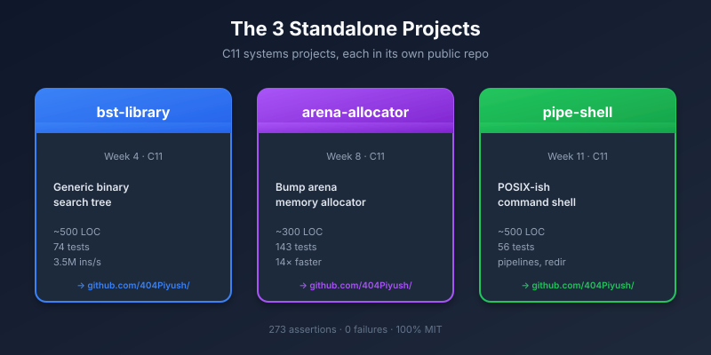
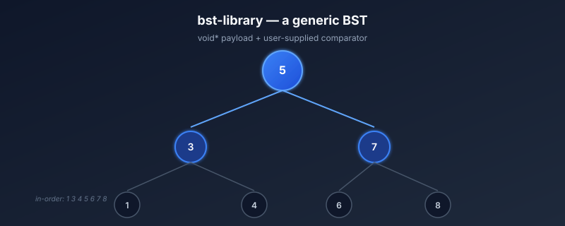
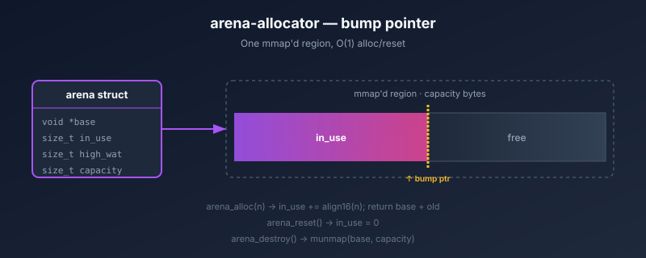
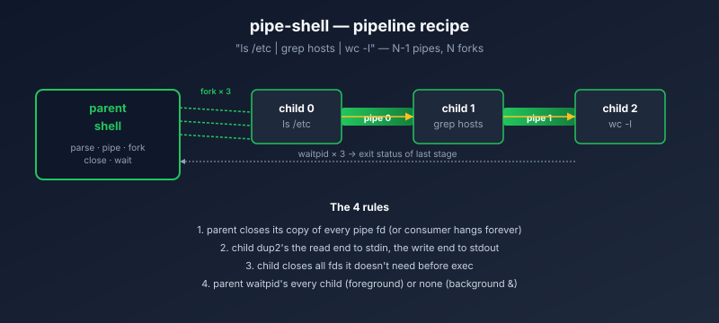
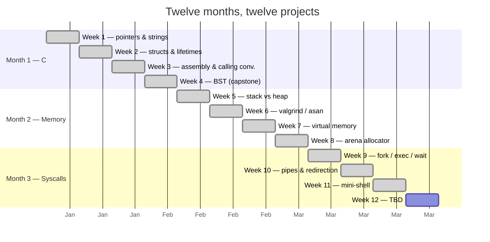

# gpu-engineering

<p align="center">
  <a href="https://github.com/404Piyush/gpu-engineering"></a>
</p>

<p align="center">
  <a href="https://github.com/404Piyush/bst-library"></a>
  <a href="https://github.com/404Piyush/arena-allocator"></a>
  <a href="https://github.com/404Piyush/pipe-shell"></a>
</p>

<p align="center">
  <a href="LICENSE"></a>
  <a href="https://github.com/404Piyush/gpu-engineering/commits/master"></a>
  <a href="#-the-3-standalone-projects"></a>
  <a href="#-per--week-content"></a>
  <a href="#-test--benchmark-summary"></a>
</p>

A twelve-month, twelve-project curriculum aimed at becoming a
GPU-systems engineer.  The repo tracks the journey — every
week, every program, every reference, every mistake.

> **TL;DR:** Three of the weeks (4, 8, 11) produced projects
> polished enough to ship as standalone public repos under
> the [404Piyush](https://github.com/404Piyush) account.  Click
> the badges above to jump to each one.

---

## 🎯 The goal

By month 12 I want to be able to:

- Write a small, correct, idiomatic C program from a spec.
- Read x86-64 disassembly and tell you what the compiler did.
- Trace a page fault from the user-space instruction to the
  kernel handler.
- Build a custom memory allocator and a custom shell.
- Reason about a GPU kernel: occupancy, divergence, coalescing.

---

## 📦 The 3 standalone projects

> **The source code lives in the standalone repos** — this
> folder ([`projects/`](projects/)) contains a thin README in
> each subfolder that points to the real project.

### 1. [`bst-library`](https://github.com/404Piyush/bst-library) — generic binary-search tree

<p align="center">
  <a href="https://github.com/404Piyush/bst-library"></a>
</p>

| | |
|---|---|
| Curriculum origin | Week 4 (Month-1 capstone) |
| Source | **[github.com/404Piyush/bst-library](https://github.com/404Piyush/bst-library)** |
| Live site | **[bst-library.404piyush.me](https://bst-library.404piyush.me)** |
| Mirror | [`projects/bst-library/`](projects/bst-library) |
| LOC | ~500 |
| Tests | **74 assertions, 8 cases — all passing** |
| Benchmark | ~3.5 M insert/s, ~4.8 M find/s (M-series) |
| License | MIT |

- **Generic** — stores `void*` payloads, accepts a user-supplied
  comparator.
- **Zero `malloc` inside the library** — caller-supplied
  allocator hook.

```sh
git clone https://github.com/404Piyush/bst-library
cd bst-library && make test
```

---

### 2. [`arena-allocator`](https://github.com/404Piyush/arena-allocator) — bump arena

<p align="center">
  <a href="https://github.com/404Piyush/arena-allocator"></a>
</p>

| | |
|---|---|
| Curriculum origin | Week 8 (Month-2 project) |
| Source | **[github.com/404Piyush/arena-allocator](https://github.com/404Piyush/arena-allocator)** |
| Live site | **[arena-allocator.404piyush.me](https://arena-allocator.404piyush.me)** |
| Mirror | [`projects/arena-allocator/`](projects/arena-allocator) |
| LOC | ~300 |
| Tests | **143 assertions, 9 cases — all passing** |
| Benchmark | **~14× faster than `malloc`** (455 M ops/s vs 33 M) |
| License | MIT |

- **O(1) every operation** — no per-allocation bookkeeping.
- **High-watermark tracking** — for memory budgeting.
- **16-byte aligned payloads** — for SIMD-friendly data.
- **The phase pattern** — perfect for parsers, request
  handlers, compilers, frame allocators.

```sh
git clone https://github.com/404Piyush/arena-allocator
cd arena-allocator && make test && make bench
```

---

### 3. [`pipe-shell`](https://github.com/404Piyush/pipe-shell) — POSIX-ish command interpreter

<p align="center">
  <a href="https://github.com/404Piyush/pipe-shell"></a>
</p>

| | |
|---|---|
| Curriculum origin | Week 11 (Month-3 capstone) |
| Source | **[github.com/404Piyush/pipe-shell](https://github.com/404Piyush/pipe-shell)** |
| Live site | **[pipe-shell.404piyush.me](https://pipe-shell.404piyush.me)** |
| Mirror | [`projects/pipe-shell/`](projects/pipe-shell) |
| LOC | ~500 |
| Tests | **56 assertions, 13 cases — all passing** |
| Features | pipelines, redirection, backgrounding, built-ins |
| License | MIT |

- **Recursive parser** — line → AST (`shell_cmd`).
- **General pipeline recipe** — N-1 pipes, N children, N-1
  parent-side `close()`s.
- **Redirection** — `<`, `>`, `>>`.
- **Background** — trailing `&`.
- **Built-ins** — `exit [N]`, `cd [DIR]`.
- **Interactive REPL and one-shot `--run` CLI.**

```sh
git clone https://github.com/404Piyush/pipe-shell
cd pipe-shell && make test && ./pipe-shell
```

---

## 🗓️ Curriculum map

| Month | Theme                          | Weeks        |
|------:|--------------------------------|--------------|
| 1     | The C machine                  | 1–4          |
| 2     | Memory is real                 | 5–8          |
| 3     | Syscalls & the process model   | 9–11         |
| 4+    | GPU engineering                | 12+ (planned) |



---

## ✅ Test & benchmark summary

| Project | Tests | Benchmark |
|---|---:|---|
| [bst-library](https://github.com/404Piyush/bst-library) | 74 assertions, 8 cases | 3.5 M insert/s, 4.8 M find/s |
| [arena-allocator](https://github.com/404Piyush/arena-allocator) | 143 assertions, 9 cases | 455 M ops/s, ~14× malloc |
| [pipe-shell](https://github.com/404Piyush/pipe-shell) | 56 assertions, 13 cases | end-to-end shell |
| **Total** | **273 assertions, 0 failures** | |

---

## 📚 Per-week content

```
gpu-engineering/
├── projects/                          (thin READMEs → standalone repos)
│   ├── bst-library/     → github.com/404Piyush/bst-library
│   ├── arena-allocator/ → github.com/404Piyush/arena-allocator
│   └── pipe-shell/      → github.com/404Piyush/pipe-shell
├── labs/year-1/                       (per-week day-N-* sub-folders)
│   ├── week-09/                       fork / exec / wait
│   ├── week-10/                       pipes / redirection
│   └── week-11/                       mini-shell
└── notes/year-1/                      (per-week journal)
    ├── week-09.md
    ├── week-10.md
    └── week-11.md
```

| Week | Topic                          | Status   | Note                                                                 |
|-----:|--------------------------------|----------|----------------------------------------------------------------------|
|  1   | Pointers & strings             | ✅       | `notes/year-1/week-01.md`                                             |
|  2   | Structs & lifetimes            | ✅       | `notes/year-1/week-02.md`                                             |
|  3   | Assembly & calling convention  | ✅       | `notes/year-1/week-03.md`                                             |
|  4   | BST capstone                   | ✅       | → [404Piyush/bst-library](https://github.com/404Piyush/bst-library)    |
|  5   | Stack vs heap                  | ✅       | `notes/year-1/week-05.md`                                             |
|  6   | Memory debugging tooling       | ✅       | `notes/year-1/week-06.md`                                             |
|  7   | Virtual memory                 | ✅       | `notes/year-1/week-07.md`                                             |
|  8   | Custom allocator               | ✅       | → [404Piyush/arena-allocator](https://github.com/404Piyush/arena-allocator) |
|  9   | fork / exec / wait             | ✅       | `notes/year-1/week-09.md`                                             |
| 10   | Pipes & redirection            | ✅       | `notes/year-1/week-10.md`                                             |
| 11   | mini-shell                     | ✅       | → [404Piyush/pipe-shell](https://github.com/404Piyush/pipe-shell)      |
| 12+  | TBD                            | 📋       | (planned)                                                             |

---

## 🔗 More pages

- [PROJECTS.md](PROJECTS.md) — full deep-dive on each
  standalone project (architecture, API, benchmarks).
- [CHANGELOG.md](CHANGELOG.md) — what changed in each
  weekly commit.
- [`projects/bst-library/`](projects/bst-library/README.md) → [404Piyush/bst-library](https://github.com/404Piyush/bst-library)
- [`projects/arena-allocator/`](projects/arena-allocator/README.md) → [404Piyush/arena-allocator](https://github.com/404Piyush/arena-allocator)
- [`projects/pipe-shell/`](projects/pipe-shell/README.md) → [404Piyush/pipe-shell](https://github.com/404Piyush/pipe-shell)

---

## License

[MIT](LICENSE).
