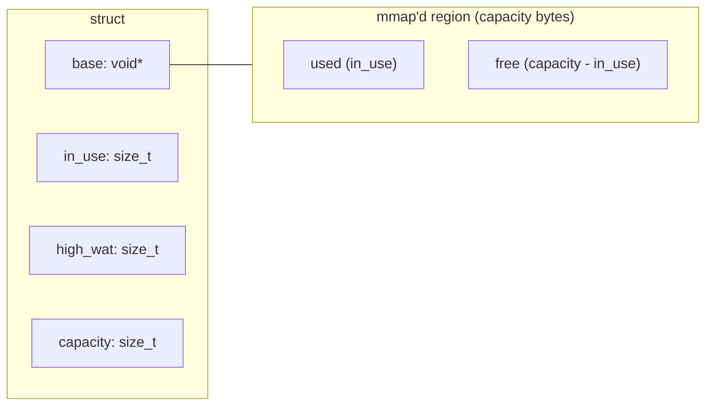
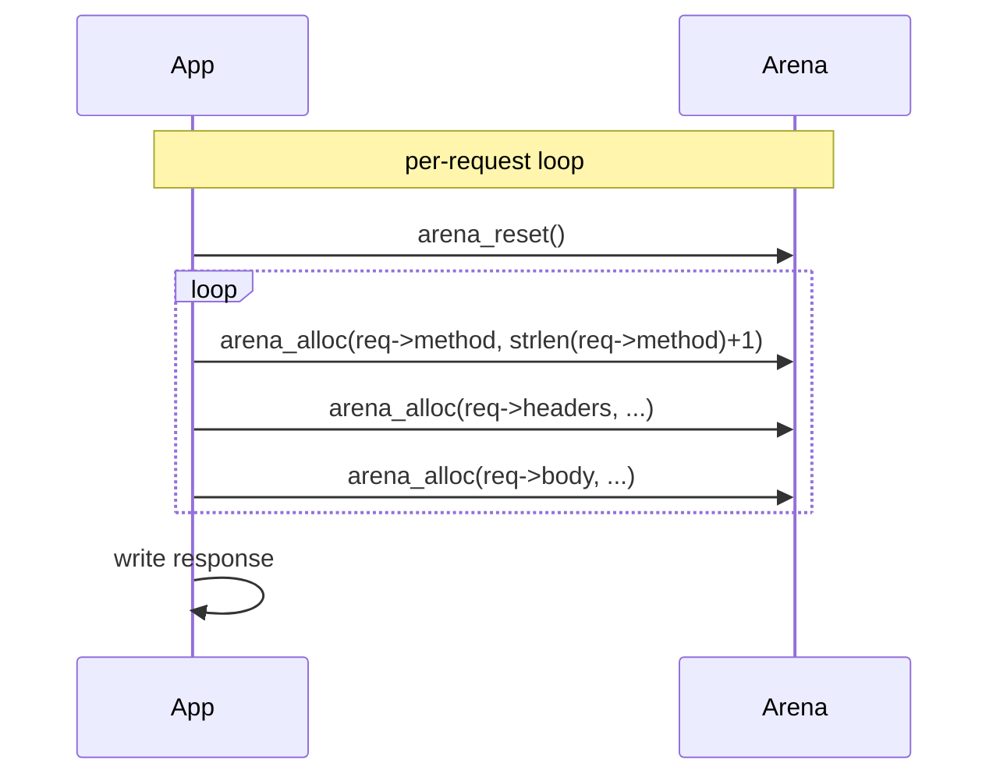

# arena-allocator — showcase

A closer look at the bump arena that ships with the
Week-8 project.

## The state of an arena



The `arena` struct is small (4 words).  The actual storage
lives in a single `mmap`'d region sized to `capacity`.

## Lifecycle

```mermaid
sequenceDiagram
    participant U as User
    participant A as arena
    participant K as kernel

    U->>A: arena_create(cap)
    A->>K: mmap(cap bytes, PROT_READ|PROT_WRITE, MAP_PRIVATE|MAP_ANON)
    K-->>A: base pointer
    A-->>U: arena*

    loop many times
        U->>A: arena_alloc(n)
        A->>A: in_use += align16(n); high_wat = max(...)
        A-->>U: base + old in_use
    end

    U->>A: arena_reset()
    A->>A: in_use = 0

    U->>A: arena_destroy()
    A->>K: munmap(base, capacity)
```

## `arena_alloc` in detail

```c
void *arena_alloc(arena *a, size_t n) {
    if (a == NULL || n == 0) return NULL;
    size_t aligned = (n + 15) & ~(size_t)15;     /* align to 16 */
    if (a->in_use + aligned > a->capacity) return NULL; /* OOM */
    void *p = (char *)a->base + a->in_use;
    a->in_use += aligned;
    if (a->in_use > a->high_wat) a->high_wat = a->in_use;
    return p;
}
```

The only arithmetic: an align-up and a bounds check.  The
hot path is roughly 4 instructions, which is why the
benchmark is ~14× faster than `malloc`.

## The phase pattern

The arena shines in the *phase* pattern: each phase
allocates freely, then resets at the end.



The cost of memory management per request collapses from
N frees to one reset.

## Numbers (Apple M-series, single thread, `-O2`)

| operation                | rate            |
|--------------------------|-----------------|
| `arena_alloc` (1×int)    | ~487 M ops/s    |
| `arena_reset`            | ~0.5 ns         |
| `malloc`/`free` (1×int)  | ~33 M ops/s     |
| 1k alloc + 1k reset      | ~480 M ops/s    |

## Repo

https://github.com/404Piyush/arena-allocator
