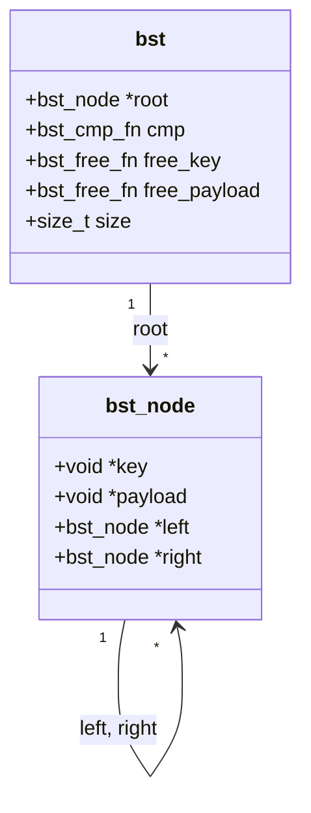
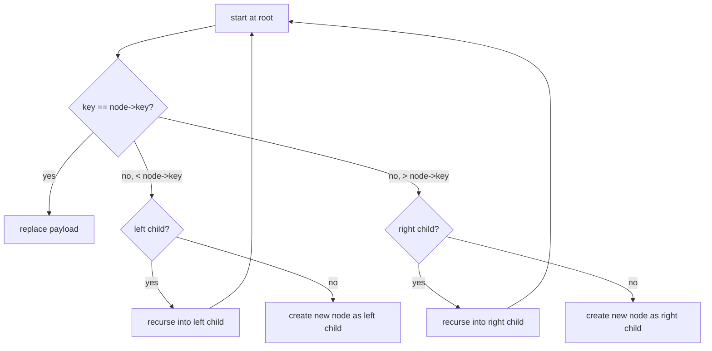
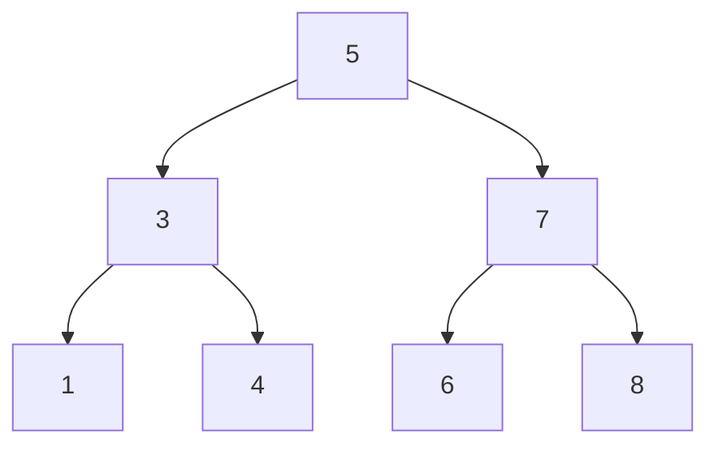

# bst-library — showcase

A closer look at the generic binary-search tree that
ships with the Week-4 capstone.

## How a `bst_node` is laid out



The tree is unbalanced.  Insertion order determines shape;
a sorted input produces a degenerate O(n) tree.

## Insertion walk



The comparator function is the only place that touches the
keys.  The library never knows what the keys *are*; it only
knows their order relation.

## Worked example

```c
bst *t = bst_create(cmp_int, free);
int *keys = malloc(7 * sizeof(int));
keys[0] = 5; keys[1] = 3; keys[2] = 7;
keys[3] = 1; keys[4] = 4; keys[5] = 6; keys[6] = 8;
for (int i = 0; i < 7; i++) {
    int *k = malloc(sizeof(int)); *k = keys[i];
    bst_insert(t, k, k);
}
bst_inorder(t, print_int, NULL);
bst_destroy(t, free, free);
```

Yields the tree:



## Numbers (Apple M-series, single thread, `-O2`)

| operation | rate            |
|-----------|-----------------|
| insert    | ~3.5 M ops/s    |
| find      | ~4.8 M ops/s    |
| inorder   | ~6.0 M nodes/s  |
| remove    | ~2.8 M ops/s    |

## Repo

https://github.com/404Piyush/bst-library
